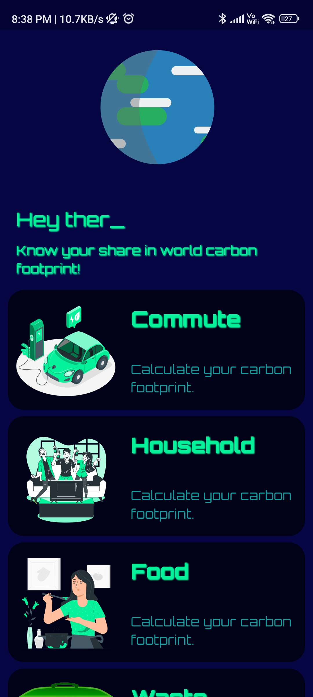
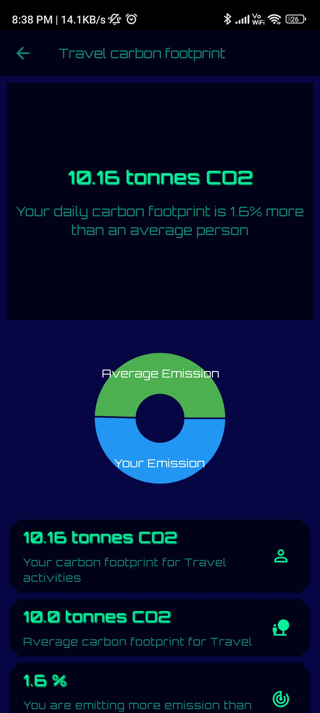
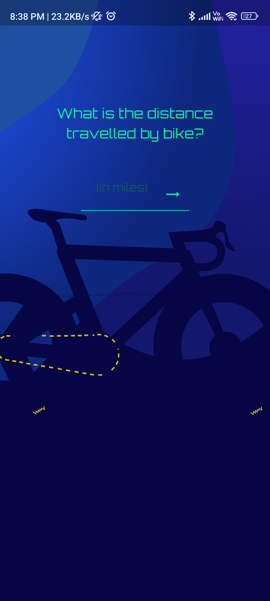
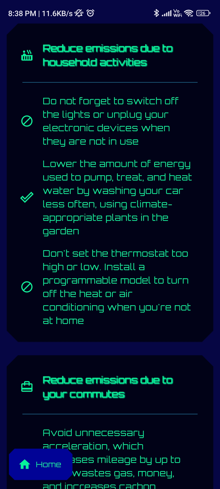
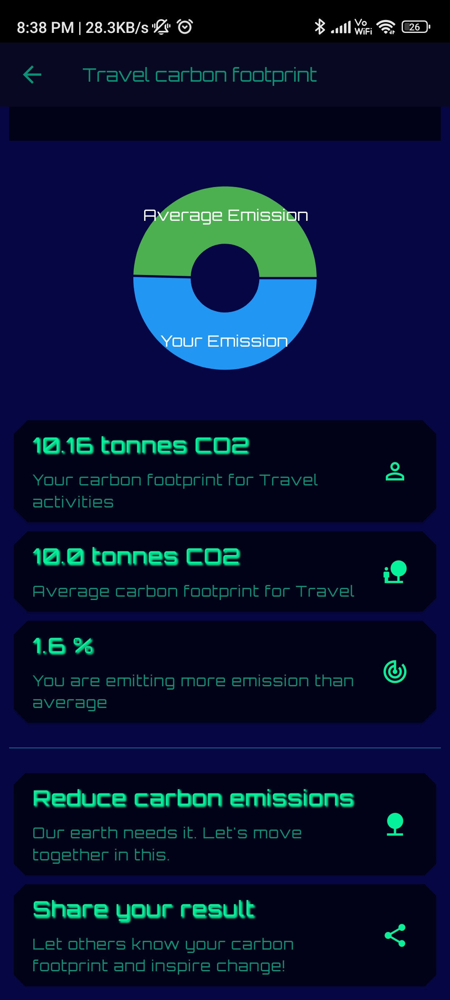

# 🌍 CarboFoot Track

A Flutter app created to track your carbon footprint, raising awareness and encouraging eco-friendly choices. Developed during a hackathon, this app provides users with personalized insights into their environmental impact.

---

## 📱 Key Features

1. **Personalized Carbon Footprint Calculator**
   - Tailored for the Indian region, the calculator covers four categories:
     - **Commute**: Calculates emissions based on your travel habits.
     - **Household**: Considers energy consumption in your home.
     - **Food**: Analyzes your food choices for their carbon impact.
     - **Waste**: Accounts for organic, electronic, and plastic waste disposal.

2. **Home Screen Overview**
   - Clean, intuitive layout with categories represented by custom icons.
   - Tap on each category to enter details and calculate emissions.
   - 

3. **Interactive Result Screen**
   - Presents a summary of your footprint with detailed insights.
   - **Pie Chart Visualization**: Shows a breakdown of your emissions by category.
   - **Comparison Section**: Compare your footprint with regional averages.
   - **Reduce Emissions Card**: Personalized suggestions to lower your emissions.
   - **Social Sharing**: Share your results to inspire eco-friendly actions.
   - 

4. **Social Sharing**
   - Encourages users to share their results on social platforms, inspiring others to reduce emissions.

---
## App Preview

- **Home**: 
- **Questions**: 
- **Reduce Screen**: 
- **Result Screen**: 
- **Result Screen**: 
---
## 🖼️ Screens and Features

### Home Screen
- **Overview**: Main screen with four categories for footprint tracking. Tap on each category to enter relevant details and calculate your footprint.
- **Category Sections**:
  - **Commute**: Calculates carbon emissions based on travel habits.
  - **Household**: Calculates household-related emissions, including energy and water usage.
  - **Food**: Considers the impact of your diet on carbon emissions.
  - **Waste**: Includes categories like organic waste, electronic waste, and plastic waste.

### Result Screen
- After inputting details, users see an interactive Result Screen with these features:
  - **Pie Chart Visualization**: Shows a breakdown of the footprint by category, highlighting major contributors.
  - **Comparison Section**: Displays the user's carbon footprint alongside the average footprint in their region for a visual comparison.
  - **Reduce Emissions Card**: Provides actionable tips based on the user's highest-emission areas.
  - **Social Sharing Button**: Users can share their footprint report to spread awareness.

---

## 🚀 Getting Started

### Prerequisites
- [Flutter SDK](https://flutter.dev/) (version 3.5.4+)
- [Dart SDK](https://dart.dev/) (for macOS arm64)

### Installation

1. Clone the repository:
   ```bash
   git clone https://github.com/your-username/carbon-footprint-tracker.git
2. Get all dependencies:
    ```bash
    flutter pub get
3. Run the app:
    ```bash
    flutter run

### Project Structure
  - /screens: Contains UI components for the calculator, result screen, and emission-reduction tips.
  - /helpers: Includes color themes and text styles and calculation data.

### Technologies Used
  - **Flutter** for cross-platform development
  - **Share Plus** for social sharing integration
  - **flutter_xlider** for interactive user inputs on sliders

### Thanks❤️❤️